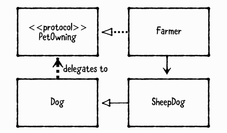

## Design Patterns by Tutorials

### 1.介绍

#### 设计模式缺点

##### If you overuse design patterns, your project can become overly complex.

##### Many design patterns are made redundant by modern programming languages.

##### Design patterns are a lazy substitute for learning object-oriented principles.

##### But, but...check out this thread on Twitter, which definitely shows that design patterns are worthless!

#### 设计模式的优点

##### 设计模式创造了一种共同语言

您可以简单地说明您认为最适合的设计模式，而不是详细描述特定解决方案。 这简化了开发人员之间的沟通。

##### 设计模式让新开发人员快速上手

使用设计模式的项目上的新开发人员比使用完全自定义逻辑的项目更容易。

##### 设计模式让你成为一个更好的人

好吧，这个可能仍然有争议。 但是一定程度的自我改善永远不会浪费！ 然而，这有一个道理，因为下一个维护你的项目的开发人员肯定会认为你是一个更好的人，因为你给他们留下了一个漂亮的，设计模式填充的项目，而不是意大利面条编码的混乱！

##### 发现代码之间的相似之处。

一旦了解并理解了不同的设计模式，就会开始注意到它们在代码中的使用。 这让您有所帮助，因为您至少对如何使用该代码非常熟悉。 例如，iOS和Mac编程大量使用了委托模式。 如果您移动到另一个也使用Delegation的平台并立即熟悉代码的组织方式，您可以轻松地发现这种模式。

### 2.Class Diagram

类图就像工程蓝图; 它们通过图片，符号和注释提供系统的相关信息。

您可能听说过统一建模语言（UML），它是用于创建类图，建筑图和其他系统插图的标准语言。 有关UML的完整讨论超出了本书的范围，但您不需要在日常的iOS开发中理解很多UML。 相反，您将在本章中学习UML的一个子集，这对于创建类图和描述设计模式很有用。

类图包括classes, protocols, properties, methods and relationships.

`Dog`类：

继承：

读的时候不要都“某某继承至某某”

直接读为“牧羊犬是一个狗”。

属性关系，（UML，association）：

继承箭头始终指向超类，属性箭头始终指向属性类。

“Famer里有条狗”

可是使用一对多的关系，但尽量还是一对一的关系。

协议：

class implements(or conforms to) a protocol:

“users”  or "dependency"(UML)

UML故意模糊“依赖”是什么。 因此，无论何时使用依赖项箭头，通常都应该注释其用途。 例如，您可以使用依赖关系箭头指示以下内容：

- weak属性或代表。
- 作为参数传递给方法但不作为属性保存的对象。
- 松耦合或回调，例如从视图到控制器的IBAction。

属性和方法

上面的完整类图

#### 类图一些例子

### 3.MVC

- **Models** 保存应用程序数据。 它们通常是结构体或简单的类。
- **Views** 在屏幕上显示可视元素和控件。 它们通常是UIView的子类。
- **Controllers** 在模型和视图之间进行协调。 它们通常是UIViewController的子类。

MVC在iOS编程中非常常见，因为它是UIKit中采用的设计模式。

允许控制器具有其模型和视图的strong属性，以便可以**直接**访问它们。 控制器可能具有多个模型和/或视图。
相反，模型和视图不应该对其拥有的控制器有强烈的关系。 这将导致**retain cycle**。

相反，模型通过**属性观察**与其控制器进行通信，将在后面的章节中深入了解，并且视图通过**IBActions**与其控制器进行通信。

>  注意：视图可能通过委托对其拥有控制器的弱引用（请参阅第4章“委托模式”）。 例如，UITableView可以为其委托和/或dataSource引用保存对其拥有的视图控制器的弱引用。 但是，table view并不知道这些设置为其拥有的控制器 - 它们恰好是。

控制器更难以重用，因为它们的逻辑通常非常特定于它们正在执行的任何任务。 因此，MVC不会尝试重用它们。

斯坦福大学课程一个相关图：

#### 什么时候使用？

#### 应该注意什么？

MVC是一个很好的起点，但它有局限性。 并非每个对象都能完全适合模型，视图或控制器的类别。 因此，仅使用MVC的应用程序往往在控制器中具有大量逻辑。 这可能导致视图控制器变得非常大！ 当发生这种情况时，有一个相当古怪的术语，称为“大规模视图控制器”。

要解决此问题，应该在应用程序需要时引入其他设计模式。